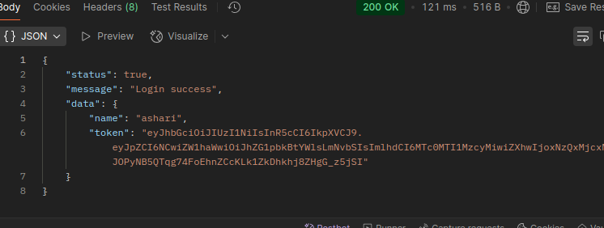
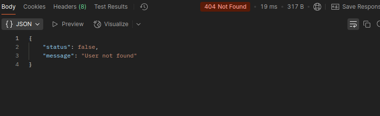

# Auth and CRUD users

This project is an API backend built using Node.js and PostgreSQL, providing authentication (login and register) and user management (create, update, delete, edit) features.

## Tech Stack
- **Node.js**
- **Express.js**
- **PostgreSQL**
- **JWT Authentication**
- **Docker**

## What is REST API?
A **REST API (Representational State Transfer Application Programming Interface)** is an architectural style for designing networked applications. It uses HTTP requests to perform CRUD (Create, Read, Update, Delete) operations on resources.

## Installation

Clone the repo:

```bash
git https://github.com/ashari-dev/auth-crud-user.git
cd auth-crud-user
```

Install the dependencies:

```bash
npm install
```

Set the environment variables:

```bash
cp .env.example .env
```

open .env

```bash
HOST_PORT = # this is the default port

DB_HOST = # database host
DB_PORT = # database port
DB_USER = # database username
DB_NAME = # database
DB_PASSWORD = # database password

JWT_SECRET = # JWT secret key
JWT_EXP = # JWT expiresIn hours
```

set the Makefile

```bash
host ?= # set the host database
port ?= # set the port database
user ?= # set the username database
pass ?= # set the password database
db ?= # set the database name
```

run docker-compose
```bash
docker compose up -d
```

run makefile for create and migrate database
```bash
make migrate:reset
```

start project 
```bash
node index.js
#or
make run
```
### API Endpoints

List of available routes:

**Auth routes**:\
`POST auth/signup` - Signup\
`POST auth/signin` - Signin\

**User routes**:\
`POST user/` - Create a user\
`GET user/` - Get all users\
`GET user/:id` - Get user\
`PUT user/:id` - Update user\
`DELETE user/:id` - Delete user\

## API Response Examples
### Success Response :


### Error Response :


